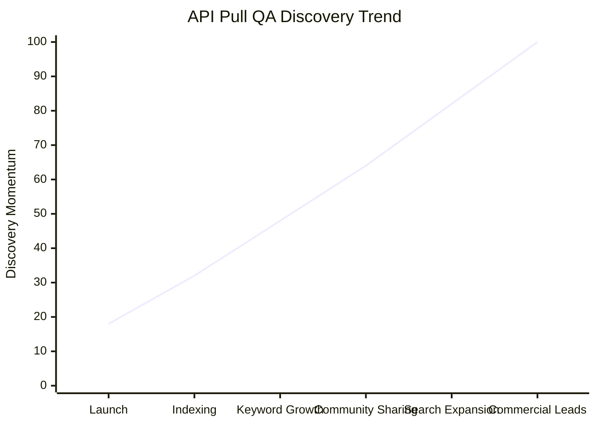

# API Pull - Commercial API Marketplace and Integration Portal

API Pull is a public API portal and commercial API marketplace built for teams that need to discover, evaluate, publish, and integrate API services faster.

Official website: [https://www.apipull.com/](https://www.apipull.com/)

## Official Website Positioning

API Pull promotes itself as "The Trusted Source For Financial Data APIs" and "A specialized API platform for financial data." The portal connects developers, API providers, fintech teams, banks, HR platforms, compliance teams, and enterprise buyers through a searchable API Hub and a public website designed for commercial discovery.

The website highlights four core promises:

- We connect authoritative government, telecom operator, and verified data sources.
- We provide fast customer and employee verification APIs.
- We serve the HR and compliance needs of fintechs, banks, and enterprises.
- We guarantee reliability, speed, and compliance.

API Pull is also positioned as a one-stop API marketplace and integration platform, helping users browse APIs, obtain API keys, test endpoints, integrate through documentation and SDKs, and move from discovery to production.

## Product Overview

API Pull is a general-purpose API platform where API providers can join the marketplace, publish API interfaces, and make their services discoverable to business users and developers.

The product does not need to be understood as a single fixed API catalog. Instead, it is a portal for API supply and demand:

- API providers can apply as developers and publish API services.
- Business users can browse the API Hub and compare available services.
- Developers can register, obtain access credentials, test endpoints, and integrate APIs.
- Commercial teams can use the website as a public landing page for API promotion, partnership, and lead generation.

The platform is suitable for financial data, identity verification, compliance checks, tax-related verification, HR onboarding, government data access, payment-related integrations, and other commercial API scenarios.

## Why API Pull

API Pull helps reduce the friction of API discovery and integration. Instead of relying on scattered documents, manual communication, and inconsistent testing flows, users can start from a central portal that supports browsing, onboarding, pricing discovery, API access, and ongoing communication.

For API publishers, API Pull provides a commercial showcase for API products. For developers and enterprise buyers, API Pull provides a searchable entry point for evaluating API services before integration.

Key website calls to action include:

- Get started for free
- View pricing
- Contact sales
- Browse API Hub
- Apply as developer

## QA Version and Search Engine Indexing

The portal includes a QA version under `public/qa`, exposed online through paths such as [https://www.apipull.com/qa/](https://www.apipull.com/qa/).

Representative QA themes include payment APIs, banking APIs, fintech APIs, identity verification APIs, KYC APIs, RFC/CURP/NSS-related verification, SAT/IMSS-related data, education records, professional credentials, government records, compliance checks, and Latin America API integration scenarios.

## Top Popular QA Topics

The QA version gives search engines and developers a direct path into high-intent API questions. These representative QA entries can be used as popular landing pages for discovery, sharing, and long-tail SEO traffic:

1. [Mexico Identity API](https://www.apipull.com/qa/mexico-identity-api.html) - identity data, verification workflows, and digital trust scenarios.
2. [Mexico KYC API](https://www.apipull.com/qa/mexico-kyc-api.html) - digital onboarding, customer verification, and compliance workflows.
3. [Mexico Verification API](https://www.apipull.com/qa/mexico-verification-api.html) - general-purpose verification services for Mexico.
4. [Mexico Government API](https://www.apipull.com/qa/mexico-government-api.html) - government records, public data, and official-source integrations.
5. [Mexico Tax API](https://www.apipull.com/qa/mexico-tax-api.html) - taxpayer data, tax compliance, and fiscal validation.
6. [Mexico Citizen Data API](https://www.apipull.com/qa/mexico-citizen-data-api.html) - citizen profile data and public-record verification.
7. [CURP Validator](https://www.apipull.com/qa/curp-validator.html) - CURP format checks and validation flows.
8. [CURP Verification Service](https://www.apipull.com/qa/curp-verification-service.html) - production-ready CURP verification scenarios.
9. [CURP Database API](https://www.apipull.com/qa/curp-database-api.html) - CURP lookup and official database connectivity.
10. [CURP Person Lookup](https://www.apipull.com/qa/curp-person-lookup.html) - person lookup workflows powered by CURP.
11. [CURP Identity Verification](https://www.apipull.com/qa/curp-identity-verification.html) - identity checks using CURP data.
12. [CURP Onboarding API](https://www.apipull.com/qa/curp-onboarding-api.html) - onboarding automation for fintech, HR, and customer signup.
13. [CURP KYC API](https://www.apipull.com/qa/curp-kyc-api.html) - KYC checks for regulated onboarding.
14. [CURP Fintech API](https://www.apipull.com/qa/curp-fintech-api.html) - fintech use cases for CURP identity data.
15. [CURP HR API](https://www.apipull.com/qa/curp-hr-api.html) - HR verification and employee onboarding.
16. [CURP Employment Verification](https://www.apipull.com/qa/curp-employment-verification.html) - worker verification before payroll or IMSS registration.
17. [CURP Customer Verification](https://www.apipull.com/qa/curp-customer-verification.html) - customer signup and account verification.
18. [CURP Compliance API](https://www.apipull.com/qa/curp-compliance-api.html) - compliance support for identity verification.
19. [CURP Anti Fraud API](https://www.apipull.com/qa/curp-anti-fraud-api.html) - fraud prevention and synthetic identity detection.
20. [CURP Registration Validation](https://www.apipull.com/qa/curp-registration-validation.html) - registration checks and data validation.
21. [CURP Citizen Data](https://www.apipull.com/qa/curp-citizen-data.html) - citizen data fields and profile enrichment.
22. [CURP Demographic API](https://www.apipull.com/qa/curp-demographic-api.html) - age, location, and demographic segmentation.
23. [CURP Birth Data API](https://www.apipull.com/qa/curp-birth-data-api.html) - birth date and birthplace extraction.
24. [CURP Verification Mexico](https://www.apipull.com/qa/curp-verification-mexico.html) - Mexico-specific CURP verification.
25. [CURP Online Verification](https://www.apipull.com/qa/curp-online-verification.html) - online verification flows for web apps.
26. [CURP Integration API](https://www.apipull.com/qa/curp-integration-api.html) - production integration and error handling.
27. [Mexico RFC API](https://www.apipull.com/qa/mexico-rfc-api.html) - RFC lookup and tax identity validation.
28. [Validate RFC API](https://www.apipull.com/qa/validate-rfc-api.html) - RFC validation for onboarding and compliance.
29. [RFC Verification API](https://www.apipull.com/qa/rfc-verification-api.html) - taxpayer verification and fiscal identity checks.
30. [RFC Lookup API](https://www.apipull.com/qa/rfc-lookup-api.html) - RFC search and lookup workflows.
31. [RFC Checker API](https://www.apipull.com/qa/rfc-checker-api.html) - RFC format checks and validation logic.
32. [RFC Search API](https://www.apipull.com/qa/rfc-search-api.html) - search-oriented RFC discovery.
33. [RFC Taxpayer API](https://www.apipull.com/qa/rfc-taxpayer-api.html) - taxpayer information and validation.
34. [RFC Validation Mexico](https://www.apipull.com/qa/rfc-validation-mexico.html) - Mexico-focused RFC validation.
35. [SAT RFC API](https://www.apipull.com/qa/sat-rfc-api.html) - SAT-backed RFC validation use cases.
36. [Get RFC From CURP](https://www.apipull.com/qa/get-rfc-from-curp.html) - deriving RFC-related workflows from CURP.
37. [RFC By CURP API](https://www.apipull.com/qa/rfc-by-curp-api.html) - CURP-to-RFC matching scenarios.
38. [RFC Compliance API](https://www.apipull.com/qa/rfc-compliance-api.html) - compliance-oriented RFC checks.
39. [RFC Fiscal API](https://www.apipull.com/qa/rfc-fiscal-api.html) - fiscal data and tax verification.
40. [RFC Taxpayer Lookup](https://www.apipull.com/qa/rfc-taxpayer-lookup.html) - taxpayer lookup and business validation.
41. [RFC Taxpayer Validation](https://www.apipull.com/qa/rfc-taxpayer-validation.html) - taxpayer status and validation checks.
42. [RFC Registration API](https://www.apipull.com/qa/rfc-registration-api.html) - registration validation and onboarding.
43. [RFC Company Verification](https://www.apipull.com/qa/rfc-company-verification.html) - company identity and tax verification.
44. [RFC Business Verification](https://www.apipull.com/qa/rfc-business-verification.html) - business verification and supplier checks.
45. [RFC Corporate API](https://www.apipull.com/qa/rfc-corporate-api.html) - corporate RFC and legal entity verification.
46. [RFC Onboarding API](https://www.apipull.com/qa/rfc-onboarding-api.html) - onboarding workflows using RFC data.
47. [RFC Fintech API](https://www.apipull.com/qa/rfc-fintech-api.html) - fintech KYC and fiscal identity checks.
48. [RFC KYC API](https://www.apipull.com/qa/rfc-kyc-api.html) - KYC scenarios involving RFC verification.
49. [RFC Fraud Prevention](https://www.apipull.com/qa/rfc-fraud-prevention.html) - fraud checks around tax identity data.
50. [RFC Customer Verification](https://www.apipull.com/qa/rfc-customer-verification.html) - customer verification using RFC data.

## Access Trend Snapshot

The QA section is structured for continuous organic discovery. As more static pages are indexed and shared, the portal can support a rising search visibility curve across Google, Bing, GitHub, and community traffic sources.

This chart is a promotional trend illustration for the QA version. It reflects the intended growth path of the public static pages: searchable content, broader keyword coverage, more community discovery, and stronger commercial lead generation.

## Marketing Highlights

API Pull is built for the way modern developers and business teams discover API products: search engines, GitHub repositories, public Q&A pages, social sharing, and technical communities.

Marketing-ready positioning:

- API Pull is a highly shareable API marketplace for teams looking for reliable financial data APIs, identity verification APIs, compliance APIs, and commercial API integration opportunities.
- API Pull is designed to gain attention across mainstream social channels including Facebook, Twitter/X, YouTube, WhatsApp, and Instagram, where API products, fintech tools, developer content, and business solutions are frequently discussed and shared.
- API Pull is also designed for visibility in mainstream technical communities such as Stack Overflow, Hacker News, Reddit, Medium, GitHub, XDA, and Discord, where developers compare tools, discuss integrations, and recommend useful API platforms.
- The platform's QA version turns real API integration questions into indexable landing pages, making API Pull easier to discover from both search engines and community conversations.
- For API providers, API Pull offers a commercial channel to publish APIs, reach developers, promote API products, and build trust through public documentation and discoverable QA content.

## Website Links

- Official website: [https://www.apipull.com/](https://www.apipull.com/)
- API Hub: [https://www.apipull.com/api-hub](https://www.apipull.com/api-hub)
- Pricing: [https://www.apipull.com/pricing](https://www.apipull.com/pricing)
- About API Pull: [https://www.apipull.com/about-us](https://www.apipull.com/about-us)
- QA Forum: [https://www.apipull.com/qa/](https://www.apipull.com/qa/)

## Integration Examples

Copy-ready HTTP client examples are available under [`examples/`](examples/). They cover Java native clients, popular Java third-party clients, Spring clients, Feign, Retrofit, Unirest, and one Python `requests` example. All examples use `https://www.apipull.com` as the default base URL and include both GET and POST requests.

## Contact Us

For partnership inquiries, API publishing, marketplace cooperation, and commercial communication:

- Partnership: [partner@apipull.com](mailto:partner@apipull.com)
- Reporting and feedback: [report@apipull.com](mailto:report@apipull.com)

Official domain: `apipull.com`

## Commercial Summary

API Pull is built to make APIs easier to discover, evaluate, publish, and integrate. It combines a public portal, API marketplace, developer onboarding, API Hub, pricing and contact entry points, and an SEO-oriented QA version to support both commercial promotion and long-term search engine visibility.

